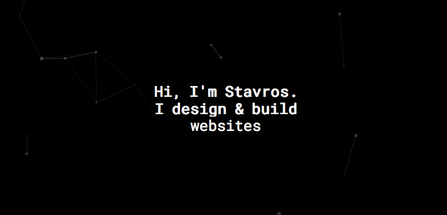

<h1 align="center">
	
</h1>

> My Nuxt.js based developer website

[](https://dependabot.com)

## Build Setup

``` bash
# install dependencies
$ yarn

# serve with hot reload at localhost:3000
$ yarn dev

# build for production and launch server
$ yarn build
$ yarn start

# generate static project (used at production server)
$ yarn generate
```

For detailed explanation on how things work, checkout the [Nuxt.js docs](https://github.com/nuxt/nuxt.js).

## Structure
- `archive` is used to store initial assets(before processing)

## Images
Images are cropped using [ImageMagick](https://www.imagemagick.org/script/index.php) and compressed using [TinyPng](https://tinypng.com/).       
`convert archive/original.png -gravity center -resize 350x240\^ -crop 350x240+0+0 +repage static/converted.png`  
Original images are stored at `/archive` for future use and the production ones under `/static`, [here is why](https://nuxtjs.org/guide/assets#static)

## Favicon
I use [cli-real-favicon](https://github.com/RealFaviconGenerator/cli-real-favicon) for generating icons.   
To generate new favicons run:  
```shell
yarn favicon-gen
``` 
You can visit the [website](https://realfavicongenerator.net) for info AND for testing the favicons   
[Source](https://realfavicongenerator.net)

## Now
Deploy `master` with now to https://stavrosliaskos.com/:
```shell
yarn deploy
```

## Useful Links
- [Nuxt layouts](https://www.youtube.com/watch?v=YOKnSTp7d38)  
- [Typed.js](https://www.npmjs.com/package/vue-typer#getting-started)


## TODO
- [decrease font and icons file size](http://fontello.com/). You can also manually download the svg and use a icon generator tool
- fade in to improve user's speed perspective
- contact section and form (connect to BE when it's available)  
- use srcset for RW images (fix device bug: project card images not centered)
- create plugin for FontFaceObserver and fix false negative error in promise
- fix console errors (typed js) | also slows down a lot "yarn dev"
- [static html fallback]( https://github.com/nuxt/nuxt.js/issues/2120)
- what is the vue way to do animationend?
- [Install App-Wide Components & Directives](https://alligator.io/vuejs/creating-custom-plugins/)
- [redirects issue from seo checker](https://github.com/nuxt/nuxt.js/issues/1592)
- disable horizontal scrolling in iphone
- horizontal list and scrolling project cards in device mode 
- 404 page doesn't work on production (-> because it's deployed as a spa)
- [add some headers](https://pwa.nuxtjs.org/modules/meta.html)
- redirect domain to use production heroku and take full advantage of nuxt features
- maybe give [this](https://github.com/shshaw/splitting/) a try? looks fancy
- https://shields.io/#/
- use #6DD8CE for active/link color? Also on select, hover, button:hover ("fills up" the button)
- what if everytime a user enters, there is another color chosen for links?
- test og images
- re-enable prettier
- future link
- fix sitemap
- add tsipiripo website
- 
- improve cards
- add portfolio here: https://github.com/evavic44/portfolio-ideas
- add a button around "Learn more about what I do": https://nuro.dev/ It's easier for the user to know where to click
- check performance
- update to latest version
- add some interactions on hover
- update content
- text-shadow: 1px 1px 10px rgb(255 255 255 / 20%), 1px 1px 10px #ccc;
- typer can be async loaded: https://github.com/straversi/Typer.js
- replace static speed insights with link to real metrics because they change over time


## Pages
/   
/about   
/contact   
/privacy-policy   
/terms-and-conditions   
/404   

## Ranking
Lighthouse Audits:
> Mobile
> - 100 Performance 
> - 55 PWA          
> - 100 Accessibility
> - 100 Best Practices
> - 100 SEO

> Desktop
> - 100 Performance 
> - 45 PWA          
> - 100 Accessibility
> - 100 Best Practices
> - 100 SEO

[page speed insights](https://developers.google.com/speed/pagespeed/insights/) 100 mobile / 100 desktop

[sitechecker](https://sitechecker.pro/) : 97%  

[structured data](https://search.google.com/structured-data/testing-tool/):  0/0/0
 
[structured data linter](http://linter.structured-data.org/): 0 

[mobile friendly test](https://search.google.com/test/mobile-friendly): passed  

## CLI Checker
Using [Webhint](https://webhint.io/) :

```
yarn hint
```

## License

The code is available under the [MIT license](LICENSE).
